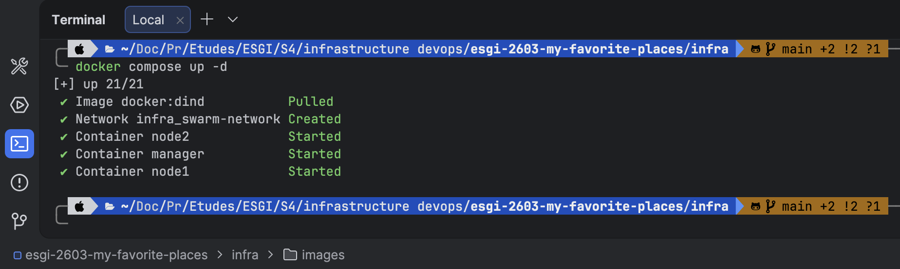
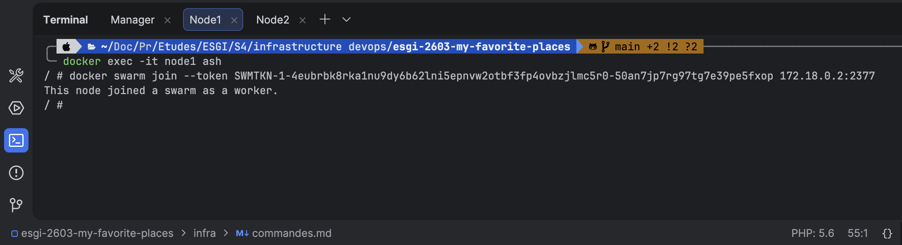

## Exo 2-3 : Création du cluster Docker Swarm / Tests du cluster

### Création d'un cluster Swarm avec Docker Compose
commande : création d'un fichier `docker-compose.yml` pour créer un cluster Swarm avec un manager et deux nodes.

PS : ici j'ai fait en sorte de créer un network pour que les conteneurs puissent communiquer entre eux.
Cependant, après la présentation de notre intervenant, j'ai compris que ce n'était pas nécessaire car les conteneurs Docker on par défaut un réseau qui leur permet de communiquer entre eux.

```YAML
services:
  manager:
    image: docker:dind
    container_name: manager
    privileged: true
    networks:
      - swarm-network

  node1:
    image: docker:dind
    container_name: node1
    privileged: true
    networks:
      - swarm-network

  node2:
    image: docker:dind
    container_name: node2
    privileged: true
    networks:
      - swarm-network

networks:
  swarm-network:
    driver: bridge
```

résultat : configuration d'un fichier de configuration docker-compose.yml pour créer un cluster Swarm avec un manager et deux nodes.

### Création des différents noeuds du cluster Swarm
commande : docker compose up -d
résultat : initialisation du cluster Swarm avec le manager et les nodes.



### Initialisation du cluster Swarm
commande : docker exec -it manager ash
résultat : accès au terminal du manager pour initialiser le cluster Swarm.

commande : docker swarm init 
résultat : initialisation du cluster Swarm avec succès dans manager.
commentaire : après l'initialisation du cluster Swarm, on obtient la commande pour permettre aux nodes de rejoindre le cluster Swarm
avec le token.


PS : si vous avez oublié votre token, vous pouvez en obtenir un nouveau en exécutant la commande `docker swarm join-token --rotate worker`

### Ajout des nodes au cluster Swarm
commande : docker exec -it {containerId/name (ex:node1)} ash
résultat : accès au terminal de node1 pour rejoindre le cluster Swarm.

commande : docker swarm join --token {TOKEN_A_RENSEIGNER} {IP_MANAGER}:2377
résultat : node1 rejoint le cluster Swarm avec succès.

commande : docker exec -it {containerId/name (ex:node2)} ash
résultat : accès au terminal de node2 pour rejoindre le cluster Swarm.



commentaire : après cela les noeuds node1 et node2 ont rejoint le cluster Swarm.

### Visualisation du cluster Swarm
commande : docker exec -it manager ash
résultat : accès au terminal du manager pour visualiser le cluster Swarm.

commande : docker node ls
résultat : affichage de la liste des nodes du cluster Swarm avec leur statut et leur rôle.


### Création stack hello-world.compose.yml 

commande : création d'un fichier `hello-world.compose.yml` pour créer une stack hello-world avec un service qui utilise l'image `hello-world`.

```YAML
services:
  hello-world:
    image: hello-world
    deploy:
      replicas: 2
```

### Installation nano
commande : apk add nano
résultat : installation de l'éditeur de texte nano pour éditer le fichier hello-world.compose.yml.


### Création répertoire manager dans home
commande : cd /home && mkdir manager
résultat : création d'un répertoire manager dans le home du manager pour stocker le fichier

se déplacer dans le répertoire manager
commande : cd manager
commande : touch hello-world.compose.yml
résultat : création du fichier hello-world.compose.yml dans le répertoire manager.
