## Exo 2-3 : Création du cluster Docker Swarm / Tests du cluster

### Création d'un cluster Swarm avec Docker Compose
commande : création d'un fichier `docker-compose.yml` pour créer un cluster Swarm avec un manager et deux nodes.

PS : ici j'ai fait en sorte de créer un network pour que les conteneurs puissent communiquer entre eux.
Cependant, après la présentation de notre intervenant, j'ai compris que ce n'était pas nécessaire car les conteneurs Docker on par défaut un réseau qui leur permet de communiquer entre eux.

```YAML
services:
  manager:
    image: docker:dind
    container_name: manager
    privileged: true

  node1:
    image: docker:dind
    container_name: node1
    privileged: true
    
  node2:
    image: docker:dind
    container_name: node2
    privileged: true
```

résultat : configuration d'un fichier de configuration docker-compose.yml pour créer un cluster Swarm avec un manager et deux nodes.

### Création des différents noeuds du cluster Swarm
commande : docker compose up -d

résultat : initialisation du cluster Swarm avec le manager et les nodes.


### Initialisation du cluster Swarm
commande : docker exec -it manager ash

résultat : accès au terminal du manager pour initialiser le cluster Swarm.

commande : docker swarm init 

résultat : initialisation du cluster Swarm avec succès dans manager.

commentaire : après l'initialisation du cluster Swarm, on obtient la commande pour permettre aux nodes de rejoindre le cluster Swarm
avec le token.

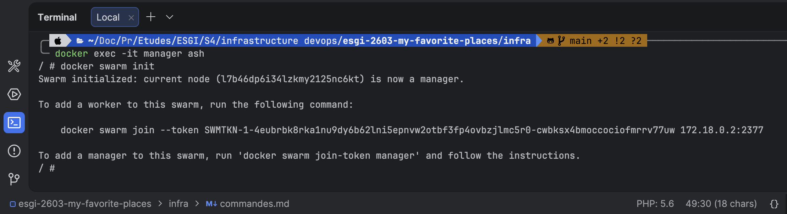

PS : si vous avez oublié votre token, vous pouvez en obtenir un nouveau en exécutant la commande `docker swarm join-token --rotate worker`

### Ajout des nodes au cluster Swarm
commande : docker exec -it {containerId/name (ex:node1)} ash

résultat : accès au terminal de node1 pour rejoindre le cluster Swarm.

commande : docker swarm join --token {TOKEN_A_RENSEIGNER} {IP_MANAGER}:2377

résultat : node1 rejoint le cluster Swarm avec succès.

commande : docker exec -it {containerId/name (ex:node2)} ash

résultat : accès au terminal de node2 pour rejoindre le cluster Swarm.


commentaire : après cela les noeuds node1 et node2 ont rejoint le cluster Swarm.

### Visualisation du cluster Swarm
commande : docker exec -it manager ash

résultat : accès au terminal du manager pour visualiser le cluster Swarm.

commande : docker node ls

résultat : affichage de la liste des nodes du cluster Swarm avec leur statut et leur rôle.

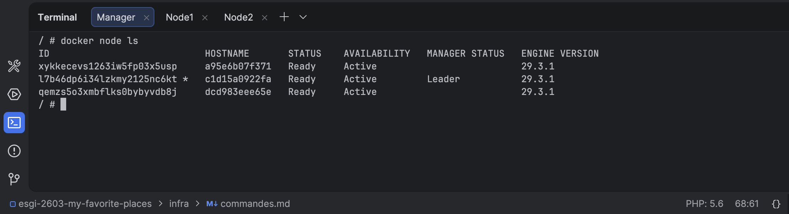

### Création stack hello-world.compose.yml 

commande : création d'un fichier `hello-world.compose.yml` pour créer une stack hello-world avec un service qui utilise l'image `hello-world`.

```YAML
services:
  hello:
    image: nmatsui/hello-world-api
    deploy:
      replicas: 2
```

### Installation nano
commande : apk add nano

résultat : installation de l'éditeur de texte nano pour éditer le fichier hello-world.compose.yml.

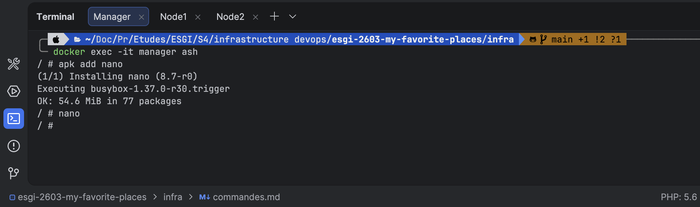

### Création répertoire manager dans home
commande : cd /home && mkdir manager

résultat : création d'un répertoire manager dans le home du manager pour stocker le fichier et se déplacer dans le répertoire manager

commande : cd manager

commande : touch hello-world.compose.yml

résultat : création du fichier hello-world.compose.yml dans le répertoire manager.

### Déploiement de la stack hello-world
commande : docker stack deploy --compose-file hello-world.compose.yml hello-world
résultat : déploiement de la stack hello-world avec succès.

commentaire : on peut changer le compose en indiquant sur quelle node on veut déployer le service hello-world en ajoutant la ligne `placement: constraints: [node.role == {NOM_NODE}]` dans le fichier hello-world.compose.yml


## Exercice 4 - Premiers tests Ansible :

### Comment démarrer 3 containeurs noeuds sans modifier le compose.yml ?

commande : docker compose up --scale node=3

résultat : démarrage de 3 conteneurs noeuds sans modifier le compose.yml.

PS : pour vérifier cela on execute la commande `docker ps` pour voir les conteneurs en cours d'exécution et vérifier que nous avons bien 3 conteneurs node qui sont en cours d'exécution.
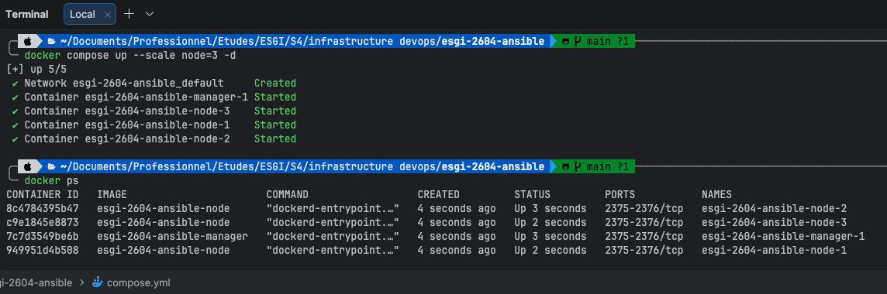

### Que fait le playbook Ansible proposé ?

commentaire : le playbook Ansible permet d'automatiser l'initialisation du cluster Swarm
et l'ajout de tous les noeuds au cluster Swarm.
Pour faire simple cela permet d'automatiser toutes les commandes et manipulation que l'on a pu faire dans les exercices précédents.
- initialisation du cluster Swarm sur le manager
- récupération du token pour permettre aux nodes de rejoindre le cluster Swarm
- ajout de tous les noeuds au cluster Swarm en utilisant le token récupéré précédemment

PS : le playbook ajoute aussi des vérifications par exemple dans le cas où un noeud est déjà dans le cluster Swarm, il ne va pas essayer de l'ajouter à nouveau et il va afficher un message d'erreur pour indiquer que le noeud est déjà dans le cluster Swarm.

### ERREUR lors du lancement du playbook Ansible
J'ai rencontré une erreur lors du lancement du playbook Ansible.
Après avoir fait plusieurs tests : test de droits des fichiers/répertoires etc...

J'ai compris que l'erreur venait du fichier `init_swarm_cluster.yml` ou l'IP du manager était sur router et non pas sur manager.
J'ai donc fait le changement dans le fichier pour lancer l'éxécution du playbook Ansible.

### Exécution du playbook Ansible
commande : `ansible-playbook -i inventory.ini init_swarm_cluster.yml -v` OU `./ansible.sh` 

PS : l'option -v permet d'afficher les détails de l'exécution du playbook Ansible pour voir les différentes étapes de l'exécution du playbook Ansible.

résultat : les différents noeuds du cluster Swarm sont bien initialisés et ajoutés au cluster Swarm.

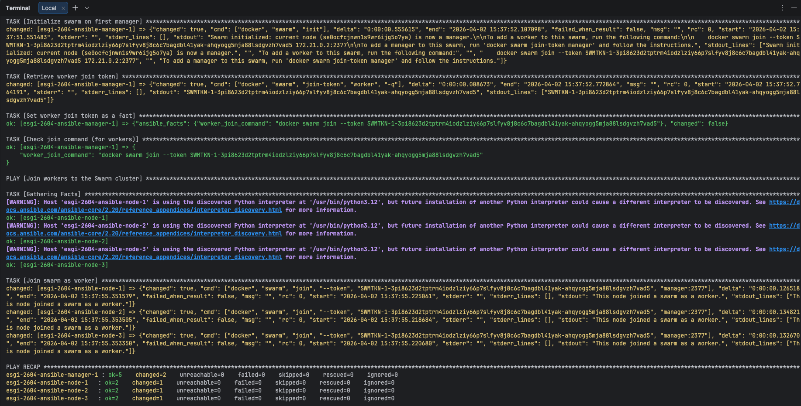

PS : on peut vérifier le cluster Swarm en se connectant au manager et en exécutant la commande `docker node ls` pour voir les différents noeuds du cluster Swarm et vérifier que tous les noeuds sont bien dans le cluster Swarm.

commande : docker exec -it esgi-2604-ansible-manager-1 ash

commande : docker node ls

### Réexécution du playbook Ansible

commentaire : le playbook Ansible permet de gérer les erreurs et faire des vérifications.
Dans notre cas il vérifie si les noeuds sont déjà dans le cluster Swarm et si c'est la cas il affiche un message d'erreur pour indiquer que le noeud est déjà dans le cluster Swarm et il ne va pas essayer de l'ajouter à nouveau.

## Exercice 5 - Comprendre Ansible :

### Ajout d'un nouveau noeud dans l'inventory.ini

commentaire : on remarque que quand on essaye de relancer le playbook Ansible 
après avoir ajouté un nouveau noeud dans l'inventory.ini, on obtient une erreur
car le playbook Ansible ne trouve pas le nouveau noeud dans le cluster Swarm.

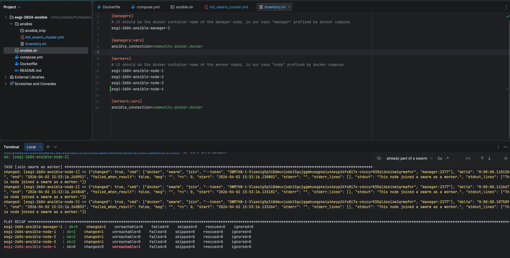

### Question que faut-il changer dans l'inventaire ET le playbook pour l'utiliser sur des VMs / VPS  Linux  ou accessible SSH ?

commentaire : Pour utiliser ce playbook Ansible sur des machines virtuelles ou des VPS Linux accessibles en SSH, 
il faut adapter l’inventaire et le playbook afin de passer d’un environnement basé sur des conteneurs Docker à un environnement réseau réel. 
Dans l’inventaire, les noms de conteneurs doivent être remplacés par les adresses IP des machines et les paramètres SSH (utilisateur, clé privée), 
car Ansible se connecte directement aux machines via SSH.

Il faut aussi penser à bien installer toutes les dépendances nécessaires sur les machines pour que le playbook Ansible puisse s’exécuter correctement comme python3 par exemple.

Dans le playbook, l’initialisation du Swarm doit être modifiée pour utiliser l’option --advertise-addr avec l’adresse IP réelle du manager, 
afin que les autres machines puissent le joindre correctement. De plus, la commande de jointure des workers doit utiliser l’adresse IP du manager sur le port 2377 
au lieu d’un nom de service ou d’hôte Docker. Enfin, il est nécessaire de s’assurer que les ports utilisés par Docker Swarm (2377, 7946 et 4789) 
sont ouverts entre les machines pour permettre la communication du cluster.

### Ansible et Terraform sont souvent utilisés ensemble, à quoi sert cet outil ?

Terraform est un outil permettant de gérer son infrastructure avec du code, c’est ce qu’on appelle l’infrastructure as code (IaC).
Il permet de créer, modifier et supprimer des ressources d’infrastructure de manière déclarative, en utilisant des fichiers de configuration.

J'ai déjà pu voir cela dans l'une de mes anciennes boite ou l'on travaillait avec AWS et on utilisait Terraform pour créer et gérer notre infrastructure sur AWS (EC2, S3, RDS etc...).

Pour ce qui est de l'utilisation avec Ansible, Terraform est souvent utilisé en complément d'Ansible pour mettre en place l'infrastructure nécessaire à l'exécution des playbooks Ansible.
Par exemple, Terraform peut être utilisé pour créer des machines virtuelles ou des conteneurs Docker sur lesquels Ansible va ensuite se connecter pour configurer les applications ou les services.
Terraform s'occupe de la partie infrastructure, tandis qu'Ansible s'occupe de la partie configuration et déploiement des applications.


## Exercice 1 - Déployer Traefik

### Mapping de port 

commentaire : on va faire en sorte de rajouter un mapping de port pour que Traefik puisse être accessible depuis l'extérieur du cluster Swarm sur le port 80.

```YAML
services:
  manager:
    build: .
    privileged: true
    ports:
      - "80:80"

node:
  build: .
  privileged: true
```

### Modification du fichier host

commentaire : on va faire en sorte de rajouter deux entrées dans le fichier host pour que Traefik 
puisse être accessible depuis l'extérieur du cluster Swarm en utilisant les noms de domaine traefik.swarm.localhost et whoami.swarm.localhost

```BASH
127.0.0.1   traefik.swarm.localhost
127.0.0.1   whoami.swarm.localhost
```

### Lancement du cluster Swarm 
commande : `docker compose up --scale node=3 -d`
commande : `./ansible.sh`

### Création d'un réseau Docker pour Traefik
commentaire : pour que Traefik puisse communiquer avec les services du cluster Swarm, il est nécessaire de créer un réseau Docker de type overlay qui sera utilisé par Traefik pour communiquer avec les services du cluster Swarm.

commande : `docker exec infra-manager-1 docker network create --driver overlay --attachable web`

résultat : yotabar8jzopmsxclymltxciu

### Copier le fichier de configuration de Traefik dans le manager

commentaire : pour que Traefik puisse être configuré correctement, il est nécessaire de copier le fichier de configuration de Traefik dans le manager pour que Traefik puisse le lire et se configurer en conséquence.

commande : `docker cp traefik-stack.yml infra-manager-1:/traefik-stack.yml`

résultat : Successfully copied 4.1kB to infra-manager-1:/traefik-stack.yml


### Déployer la stack depuis le manager

commentaire : pour déployer la stack Traefik, il est nécessaire de se connecter au manager et de déployer la stack en utilisant le fichier de configuration de Traefik qui a été copié précédemment.

commande : `docker exec -it infra-manager-1 ash`

commande : `docker stack deploy --compose-file traefik-stack.yml traefik`

résultat : Since --detach=false was not specified, tasks will be created in the background.
In a future release, --detach=false will become the default.
Creating service traefik_traefik
Creating service traefik_whoami

### Vérification du déploiement de la stack Traefik

commande : `docker exec infra-manager-1 docker stack services traefik`

résultat : 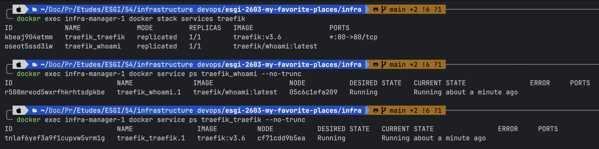

Aller sur http://traefik.swarm.localhost et http://whoami.swarm.localhost pour vérifier que Traefik est bien configuré et que les services sont accessibles depuis l'extérieur du cluster Swarm.

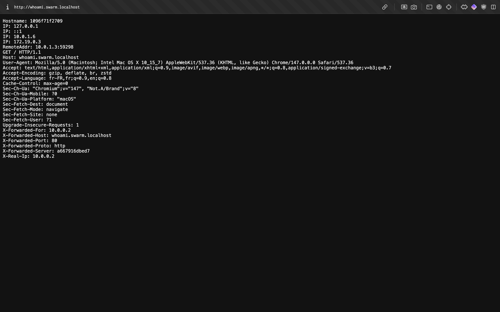

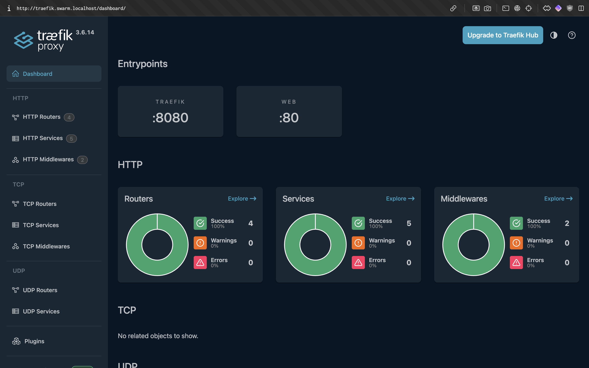

## Exercice 2 - Déployer une autre application

### Récupération de l'image de l'application example-voting-app

commande : `git clone https://github.com/dockersamples/example-voting-app.git` 

### Lancer l'application example-voting-app sans cluster Swarm

commentaire : se déplacer dans le répertoire de l'application example-voting-app et lancer l'application en utilisant Docker Compose.

commande : `docker compose up -d`

### Création d'un fichier docker-compose.yml pour déployer l'application example-voting-app

```YAML
services:
  vote:
    image: dockersamples/examplevotingapp_vote
    networks:
      - front-tier
      - web
    deploy:
      replicas: 2
      labels:
        - "traefik.enable=true"
        - "traefik.http.routers.vote.rule=Host(`vote.swarm.localhost`)"
        - "traefik.http.routers.vote.entrypoints=web"
        - "traefik.http.services.vote.loadbalancer.server.port=80"

  result:
    image: dockersamples/examplevotingapp_result
    networks:
      - back-tier
      - web
    deploy:
      replicas: 1
      labels:
        - "traefik.enable=true"
        - "traefik.http.routers.result.rule=Host(`result.swarm.localhost`)"
        - "traefik.http.routers.result.entrypoints=web"
        - "traefik.http.services.result.loadbalancer.server.port=80"

  worker:
    image: dockersamples/examplevotingapp_worker
    networks:
      - front-tier
      - back-tier
    deploy:
      replicas: 1

  redis:
    image: redis:alpine
    networks:
      - front-tier

  db:
    image: postgres:15-alpine
    environment:
      POSTGRES_USER: "postgres"
      POSTGRES_PASSWORD: "postgres"
    volumes:
      - db_data:/var/lib/postgresql/data
    networks:
      - back-tier
    deploy:
      placement:
        constraints:
          - node.role == manager

volumes:
  db_data:

networks:
  front-tier:
    driver: overlay
  back-tier:
    driver: overlay
  web:
    external: true
```

### Déployer l'application example-voting-app sur le cluster Swarm

commentaire : après avoir créé le fichier docker-compose.yml voting-stack.yml 
il est nécessaire de se connecter au manager et de déployer la stack en utilisant le fichier de configuration de l'application example-voting-app qui a été créé précédemment.

commande : `docker cp voting-stack.yml infra-manager-1:/voting-stack.yml`

commande : `docker exec -it infra-manager-1 ash`

commande : `docker stack deploy --compose-file voting-stack.yml voting`

### Mettre à jour le fichier host

commande : ajouter les entrées suivantes dans le fichier host
```BASH
127.0.0.1   vote.swarm.localhost
127.0.0.1   result.swarm.localhost
```

### Vérification du déploiement de l'application example-voting-app

commande : `docker exec infra-manager-1 docker stack services voting`

commentaire : aller sur http://vote.swarm.localhost et http://result.swarm.localhost 
pour vérifier que l'application example-voting-app est bien configurée et que les services sont accessibles depuis l'extérieur du cluster Swarm.

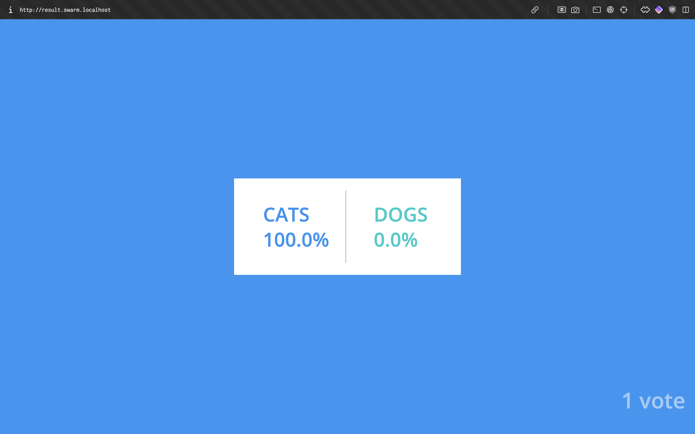

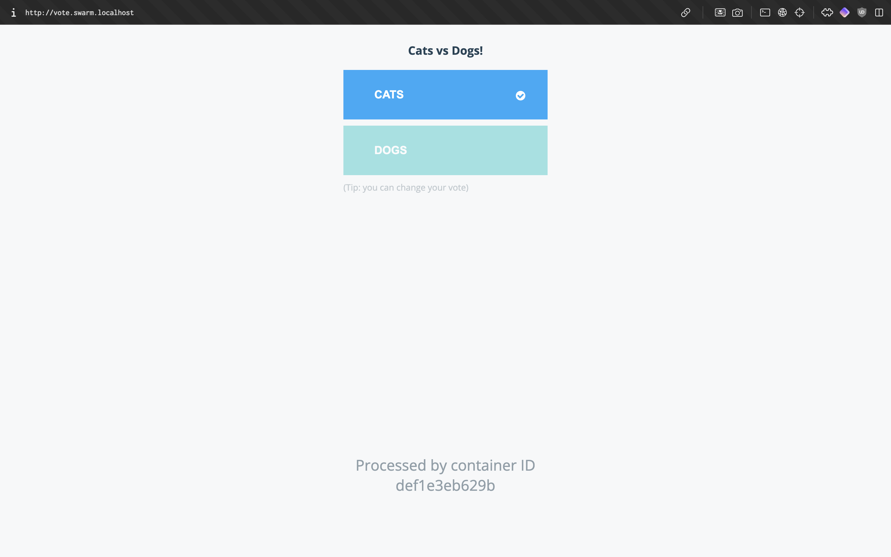


