# Rendu des commandes

BOURGUIGNEAU 
ETHAN 
M2 IW

## Exercice 1 - Dockerization du projet :

### Introduction du projet : my favorite place

Commentaire : Impossible de lancer le projet, car il n'y a pas de base de données vu que le compose n'est pas créé. On verra par la suite du TP comment faire.

### Dockerfile

```DOCKERFILE
FROM node:25.8.0-alpine3.23 AS builder

WORKDIR /app

COPY package*.json ./

RUN npm install

COPY . .

RUN npm run build


FROM node:25.8.0-alpine3.23

WORKDIR /app

COPY package*.json ./

RUN npm install --omit=dev

COPY --from=builder /app/dist ./dist

EXPOSE 3000

CMD ["npm", "start"]
```

### Compose YAML

Création d'un fichier docker compose qui permettra d'avoir une base de données et ou l'application my favorite places pourra se connecter.

```YAML
services:

  postgres:
    image: postgres:16
    container_name: favorite_places_db
    restart: always
    environment:
      POSTGRES_USER: postgres
      POSTGRES_PASSWORD: supersecret
      POSTGRES_DB: postgres
    ports:
      - "5432:5432"
    volumes:
      - postgres_data:/var/lib/postgresql/data
    networks:
      - favorite_places_network
    healthcheck:
      test: ["CMD-SHELL", "pg_isready -U postgres"]
      interval: 10s
      timeout: 5s
      retries: 5
      start_period: 10s


  server:
    build:
      context: ./server
    container_name: favorite_places_server
    restart: always
    depends_on:
      postgres:
        condition: service_healthy
    environment:
      DB_HOST: postgres
      DB_USER: postgres
      DB_PASSWORD: supersecret
      DB_NAME: postgres
    ports:
      - "3000:3000"
    networks:
      - favorite_places_network

  client:
    build:
      context: ./client
    container_name: favorite_places_client
    restart: always
    ports:
      - "5173:80"
    networks:
      - favorite_places_network

volumes:
  postgres_data:

networks:
  favorite_places_network:
    driver: bridge
```

pour les credentials, je me suis aidé de la configuration dans le serveur :

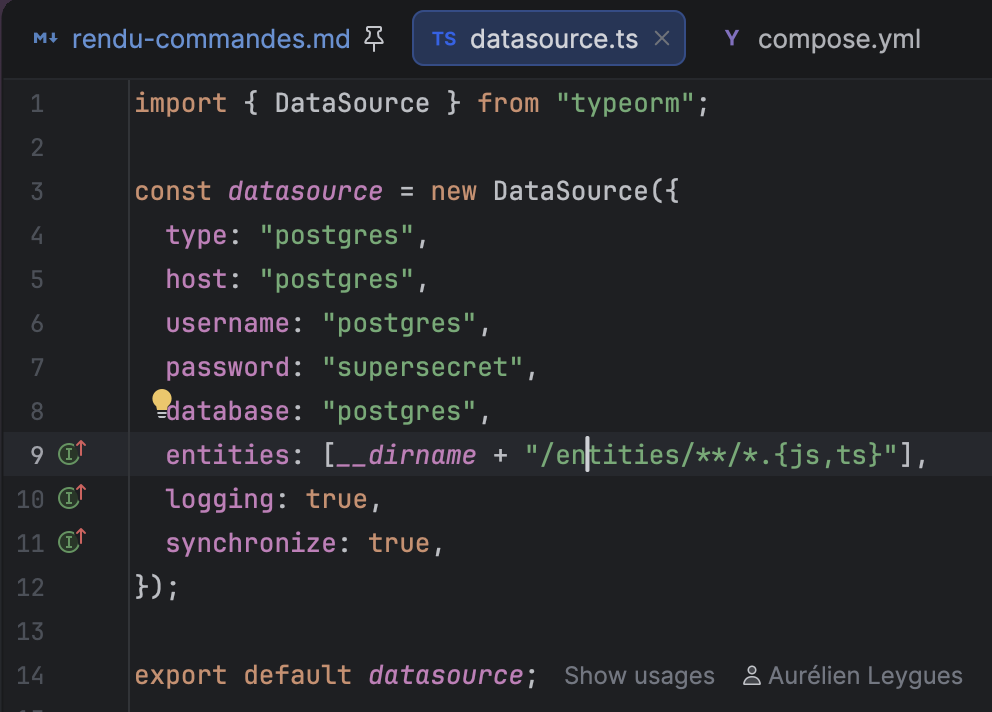

PS : pour plus de sécurité, il faudrait ajouter un fichier d'environnement pour stocker les credentials de la DB.

j'ai rajouté dans mon compose le depends_on qui me permet de faire en sorte que le serveur ne démarrer qu'après que la BDD soit prête.
Et le restart: always permet lui de redémarer automatiquement les containers.

### Test Bruno

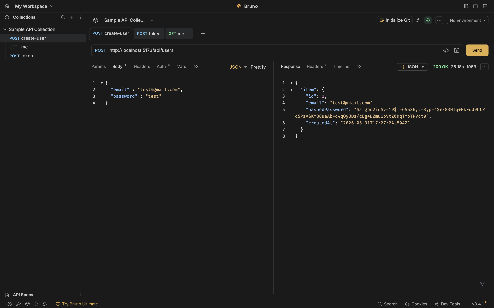

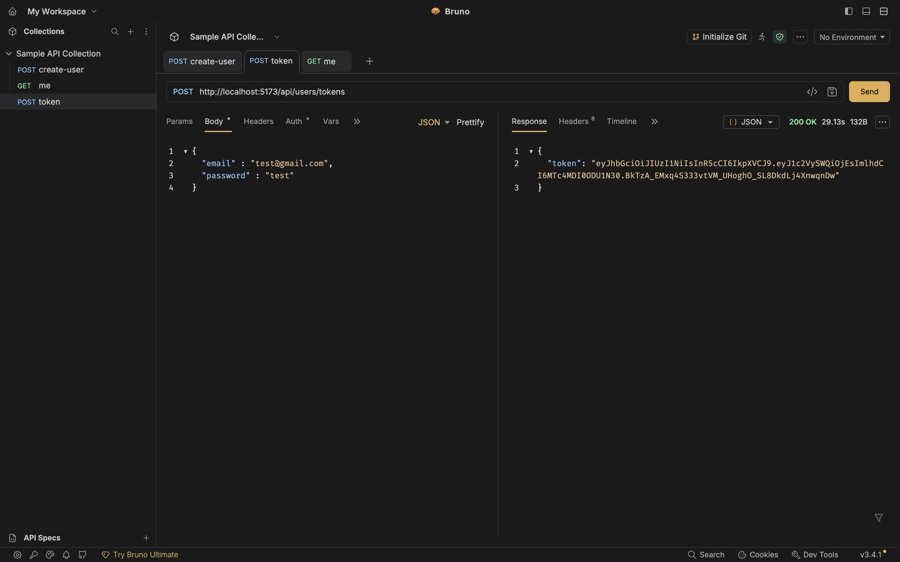

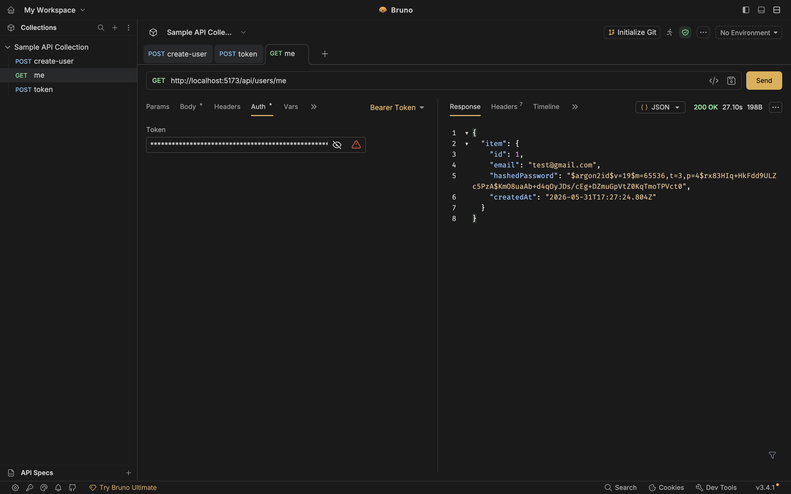

## Exercice 2 - Mettre en place une CI :

Voici le github-actions finale que j'ai créer pour le build des images docker du back et frontend

```YAML
name: MFP CI

on:
  push:
    branches:
      - main

permissions:
  contents: read
  packages: write

jobs:
  build:
    runs-on: ubuntu-latest

    steps:
      - name: Checkout repository
        uses: actions/checkout@v3

      - name: Use Node.js
        uses: actions/setup-node@v4
        with:
          node-version: '20.x'

      - name: Install backend dependencies
        working-directory: ./server
        run: npm install

      - name: Run backend tests
        working-directory: ./server
        run: npm test

      - name: Set up QEMU
        uses: docker/setup-qemu-action@v3

      - name: Setup Docker Buildx
        uses: docker/setup-buildx-action@v3

      - name: Get short SHA
        id: vars
        run: echo "sha_short=$(echo $GITHUB_SHA | cut -c1-7)" >> $GITHUB_OUTPUT

      - name: Log in to GitHub Container Registry
        uses: docker/login-action@v2
        with:
          registry: ghcr.io
          username: ${{ github.actor }}
          password: ${{ secrets.GITHUB_TOKEN }}

      - name: Build and push backend Docker image
        uses: docker/build-push-action@v5
        with:
          context: ./server
          platforms: linux/amd64,linux/arm64
          push: true
          provenance: false
          tags: |
            ghcr.io/a5hura666/favorite_places_server:latest
            ghcr.io/a5hura666/favorite_places_server:main
            ghcr.io/a5hura666/favorite_places_server:sha-${{ steps.vars.outputs.sha_short }}

      - name: Build and push frontend Docker image
        uses: docker/build-push-action@v5
        with:
          context: ./client
          platforms: linux/amd64,linux/arm64
          push: true
          provenance: false
          tags: |
            ghcr.io/a5hura666/favorite_places_client:latest
            ghcr.io/a5hura666/favorite_places_client:main
            ghcr.io/a5hura666/favorite_places_client:sha-${{ steps.vars.outputs.sha_short }}
```

Création d'un test getDistance.ts

J'ai créé un fichier getDistance.test.ts :

```JS
import {getDistance} from "../../utils/getDistance";


describe('getDistance', () => {
    it('should return 0 if points are identical', () => {
        const point = { lat: 0, lng: 0 };
        expect(getDistance(point, point)).toBeCloseTo(0);
    });

    it('should return correct distance between Paris and London', () => {
        const paris = { lat: 48.8566, lng: 2.3522 };
        const london = { lat: 51.5074, lng: -0.1278 };

        const distance = getDistance(paris, london);
        expect(distance).toBeCloseTo(343.56, 1);
    });
});
```

Ensuite dans mon package.json j'ai créé une nouvelle entrée de script "test" :

```JSON
{
  "name": "server",
  "version": "1.0.1",
  "main": "index.js",
  "license": "MIT",
  "scripts": {
    "build": "tsc",
    "start": "node dist/index.js",
    "dev": "nodemon src/index.ts",
    "test": "jest"
  },
  "dependencies": {
    "argon2": "^0.44.0",
    "axios": "^1.13.5",
    "express": "^5.2.1",
    "jsonwebtoken": "^9.0.3",
    "pg": "^8.19.0",
    "typeorm": "^0.3.28"
  },
  "devDependencies": {
    "@types/express": "^5.0.6",
    "@types/jest": "^30.0.0",
    "@types/jsonwebtoken": "^9.0.10",
    "jest": "^30.2.0",
    "nodemon": "^3.1.11",
    "ts-jest": "^29.4.6",
    "ts-node": "^10.9.2",
    "typescript": "^5.9.3"
  }
}
```

Ce qui fait que quand on fera un npm test dans la CI 
cela va lancer les tests que j'aurai setup 
et que j'ai mis au-dessus ce qui me permet de venir tester mon code.

## Exercice 3 - Vérifiez les images produites :

Création d'un fichier compose.prod.yml qui est une copie de compose.yml 
qu'on a créé précédemment mais cette fois ci on vient récupérer les images
que l'on a build directement sur notre répôt GITHUB.

```YAML
version: "3.9"

services:

  postgres:
    image: postgres:16
    container_name: favorite_places_db
    restart: always
    environment:
      POSTGRES_USER: postgres
      POSTGRES_PASSWORD: supersecret
      POSTGRES_DB: postgres
    ports:
      - "5432:5432"
    volumes:
      - postgres_data:/var/lib/postgresql/data
    networks:
      - favorite_places_network
    healthcheck:
      test: ["CMD-SHELL", "pg_isready -U postgres"]
      interval: 10s
      timeout: 5s
      retries: 5
      start_period: 10s

  server:
    image: ghcr.io/a5hura666/favorite_places_server:latest
    container_name: favorite_places_server
    restart: always
    depends_on:
      postgres:
        condition: service_healthy
    environment:
      DB_HOST: postgres
      DB_USER: postgres
      DB_PASSWORD: supersecret
      DB_NAME: postgres
    ports:
      - "3000:3000"
    networks:
      - favorite_places_network

  client:
    image: ghcr.io/a5hura666/favorite_places_client:latest
    container_name: favorite_places_client
    restart: always
    depends_on:
      - server
    ports:
      - "5173:80"
    networks:
      - favorite_places_network

volumes:
  postgres_data:

networks:
  favorite_places_network:
    driver: bridge
```

Voici une capture d'écran des images docker front et back créer dans mon répôt :

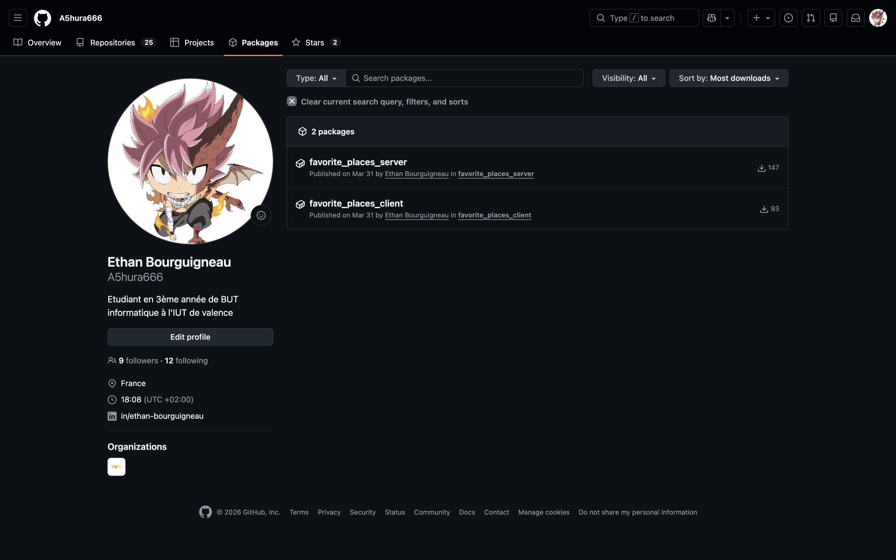

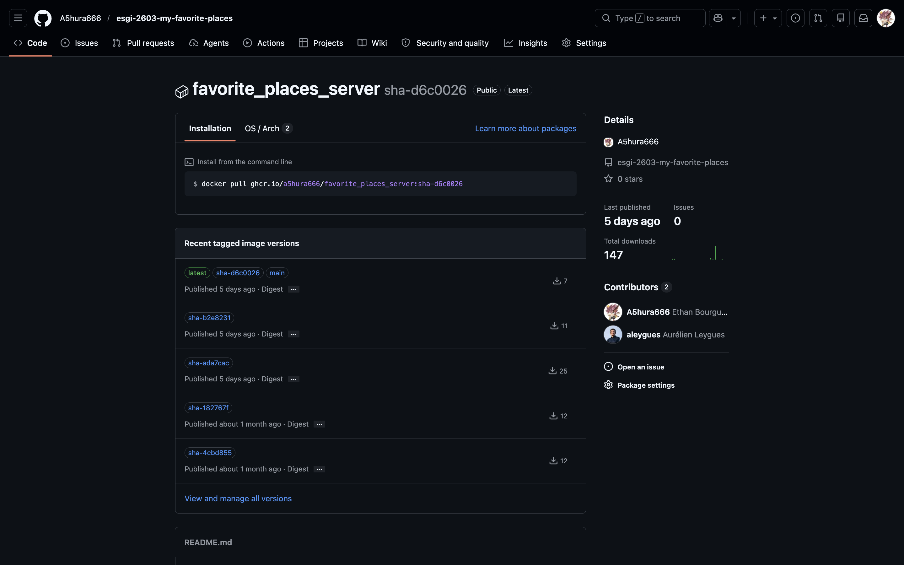


## Exercice 1 : Docker Swarm

L’architecture Docker-in-Docker (DinD) permet d’exécuter un démon Docker au sein d’un conteneur, créant ainsi un environnement Docker complètement distinct de l’hôte vous permettant de faire des tests ou proposer un environnement de formation. A l’opposé, l’architecture Docker-out-of-Docker (DooD) s’appuie sur le démon Docker de la machine hôte en ayant recours à un conteneur pour partager le socket Docker. Cela permet une solution plus légère et plus performante, mais beaucoup moins isolée.

Pour tester Docker Swarm sur la base de DinD, on peut se créer plusieurs conteneurs DinD jouant le rôle de nœuds du cluster : un conteneur manager et plusieurs conteneurs worker. Chacun d’eux exécute son propre démon Docker et la communication entre les nœuds se fera via un réseau Docker. Cette solution permet de simuler un cluster Swarm complet sur une seule machine

## Exo 2-3 : Création du cluster Docker Swarm / Tests du cluster

### Création d'un cluster Swarm avec Docker Compose
commande : création d'un fichier `docker-compose.yml` pour créer un cluster Swarm avec un manager et deux nodes.

PS : ici j'ai fait en sorte de créer un network pour que les conteneurs puissent communiquer entre eux.
Cependant, après la présentation de notre intervenant, j'ai compris que ce n'était pas nécessaire car les conteneurs Docker on par défaut un réseau qui leur permet de communiquer entre eux.

```YAML
services:
  manager:
    image: docker:dind
    container_name: manager
    privileged: true

  node1:
    image: docker:dind
    container_name: node1
    privileged: true
    
  node2:
    image: docker:dind
    container_name: node2
    privileged: true
```

résultat : configuration d'un fichier de configuration docker-compose.yml pour créer un cluster Swarm avec un manager et deux nodes.

### Création des différents noeuds du cluster Swarm
commande : docker compose up -d

résultat : initialisation du cluster Swarm avec le manager et les nodes.


### Initialisation du cluster Swarm
commande : docker exec -it manager ash

résultat : accès au terminal du manager pour initialiser le cluster Swarm.

commande : docker swarm init 

résultat : initialisation du cluster Swarm avec succès dans manager.

commentaire : après l'initialisation du cluster Swarm, on obtient la commande pour permettre aux nodes de rejoindre le cluster Swarm
avec le token.


PS : si vous avez oublié votre token, vous pouvez en obtenir un nouveau en exécutant la commande `docker swarm join-token --rotate worker`

### Ajout des nodes au cluster Swarm
commande : docker exec -it {containerId/name (ex:node1)} ash

résultat : accès au terminal de node1 pour rejoindre le cluster Swarm.

commande : docker swarm join --token {TOKEN_A_RENSEIGNER} {IP_MANAGER}:2377

résultat : node1 rejoint le cluster Swarm avec succès.

commande : docker exec -it {containerId/name (ex:node2)} ash

résultat : accès au terminal de node2 pour rejoindre le cluster Swarm.


commentaire : après cela les noeuds node1 et node2 ont rejoint le cluster Swarm.

### Visualisation du cluster Swarm
commande : docker exec -it manager ash

résultat : accès au terminal du manager pour visualiser le cluster Swarm.

commande : docker node ls

résultat : affichage de la liste des nodes du cluster Swarm avec leur statut et leur rôle.


### Création stack hello-world.compose.yml 

commande : création d'un fichier `hello-world.compose.yml` pour créer une stack hello-world avec un service qui utilise l'image `hello-world`.

```YAML
services:
  hello:
    image: nmatsui/hello-world-api
    deploy:
      replicas: 2
```

### Installation nano
commande : apk add nano

résultat : installation de l'éditeur de texte nano pour éditer le fichier hello-world.compose.yml.


### Création répertoire manager dans home
commande : cd /home && mkdir manager

résultat : création d'un répertoire manager dans le home du manager pour stocker le fichier et se déplacer dans le répertoire manager

commande : cd manager

commande : touch hello-world.compose.yml

résultat : création du fichier hello-world.compose.yml dans le répertoire manager.

### Déploiement de la stack hello-world
commande : docker stack deploy --compose-file hello-world.compose.yml hello-world
résultat : déploiement de la stack hello-world avec succès.

commentaire : on peut changer le compose en indiquant sur quelle node on veut déployer le service hello-world en ajoutant la ligne `placement: constraints: [node.role == {NOM_NODE}]` dans le fichier hello-world.compose.yml


## Exercice 4 - Premiers tests Ansible :

### Comment démarrer 3 containeurs noeuds sans modifier le compose.yml ?

commande : docker compose up --scale node=3

résultat : démarrage de 3 conteneurs noeuds sans modifier le compose.yml.

PS : pour vérifier cela on execute la commande `docker ps` pour voir les conteneurs en cours d'exécution et vérifier que nous avons bien 3 conteneurs node qui sont en cours d'exécution.


### Que fait le playbook Ansible proposé ?

commentaire : le playbook Ansible permet d'automatiser l'initialisation du cluster Swarm
et l'ajout de tous les noeuds au cluster Swarm.
Pour faire simple cela permet d'automatiser toutes les commandes et manipulation que l'on a pu faire dans les exercices précédents.
- initialisation du cluster Swarm sur le manager
- récupération du token pour permettre aux nodes de rejoindre le cluster Swarm
- ajout de tous les noeuds au cluster Swarm en utilisant le token récupéré précédemment

PS : le playbook ajoute aussi des vérifications par exemple dans le cas où un noeud est déjà dans le cluster Swarm, il ne va pas essayer de l'ajouter à nouveau et il va afficher un message d'erreur pour indiquer que le noeud est déjà dans le cluster Swarm.

### ERREUR lors du lancement du playbook Ansible
J'ai rencontré une erreur lors du lancement du playbook Ansible.
Après avoir fait plusieurs tests : test de droits des fichiers/répertoires etc...

J'ai compris que l'erreur venait du fichier `init_swarm_cluster.yml` ou l'IP du manager était sur router et non pas sur manager.
J'ai donc fait le changement dans le fichier pour lancer l'éxécution du playbook Ansible.

### Exécution du playbook Ansible
commande : `ansible-playbook -i inventory.ini init_swarm_cluster.yml -v` OU `./ansible.sh` 

PS : l'option -v permet d'afficher les détails de l'exécution du playbook Ansible pour voir les différentes étapes de l'exécution du playbook Ansible.

résultat : les différents noeuds du cluster Swarm sont bien initialisés et ajoutés au cluster Swarm.


PS : on peut vérifier le cluster Swarm en se connectant au manager et en exécutant la commande `docker node ls` pour voir les différents noeuds du cluster Swarm et vérifier que tous les noeuds sont bien dans le cluster Swarm.

commande : docker exec -it esgi-2604-ansible-manager-1 ash

commande : docker node ls

### Réexécution du playbook Ansible

commentaire : le playbook Ansible permet de gérer les erreurs et faire des vérifications.
Dans notre cas il vérifie si les noeuds sont déjà dans le cluster Swarm et si c'est la cas il affiche un message d'erreur pour indiquer que le noeud est déjà dans le cluster Swarm et il ne va pas essayer de l'ajouter à nouveau.

## Exercice 5 - Comprendre Ansible :

### Ajout d'un nouveau noeud dans l'inventory.ini

commentaire : on remarque que quand on essaye de relancer le playbook Ansible 
après avoir ajouté un nouveau noeud dans l'inventory.ini, on obtient une erreur
car le playbook Ansible ne trouve pas le nouveau noeud dans le cluster Swarm.


### Question que faut-il changer dans l'inventaire ET le playbook pour l'utiliser sur des VMs / VPS  Linux  ou accessible SSH ?

commentaire : Pour utiliser ce playbook Ansible sur des machines virtuelles ou des VPS Linux accessibles en SSH, 
il faut adapter l’inventaire et le playbook afin de passer d’un environnement basé sur des conteneurs Docker à un environnement réseau réel. 
Dans l’inventaire, les noms de conteneurs doivent être remplacés par les adresses IP des machines et les paramètres SSH (utilisateur, clé privée), 
car Ansible se connecte directement aux machines via SSH.

Il faut aussi penser à bien installer toutes les dépendances nécessaires sur les machines pour que le playbook Ansible puisse s’exécuter correctement comme python3 par exemple.

Dans le playbook, l’initialisation du Swarm doit être modifiée pour utiliser l’option --advertise-addr avec l’adresse IP réelle du manager, 
afin que les autres machines puissent le joindre correctement. De plus, la commande de jointure des workers doit utiliser l’adresse IP du manager sur le port 2377 
au lieu d’un nom de service ou d’hôte Docker. Enfin, il est nécessaire de s’assurer que les ports utilisés par Docker Swarm (2377, 7946 et 4789) 
sont ouverts entre les machines pour permettre la communication du cluster.

### Ansible et Terraform sont souvent utilisés ensemble, à quoi sert cet outil ?

Terraform est un outil permettant de gérer son infrastructure avec du code, c’est ce qu’on appelle l’infrastructure as code (IaC).
Il permet de créer, modifier et supprimer des ressources d’infrastructure de manière déclarative, en utilisant des fichiers de configuration.

J'ai déjà pu voir cela dans l'une de mes anciennes boite ou l'on travaillait avec AWS et on utilisait Terraform pour créer et gérer notre infrastructure sur AWS (EC2, S3, RDS etc...).

Pour ce qui est de l'utilisation avec Ansible, Terraform est souvent utilisé en complément d'Ansible pour mettre en place l'infrastructure nécessaire à l'exécution des playbooks Ansible.
Par exemple, Terraform peut être utilisé pour créer des machines virtuelles ou des conteneurs Docker sur lesquels Ansible va ensuite se connecter pour configurer les applications ou les services.
Terraform s'occupe de la partie infrastructure, tandis qu'Ansible s'occupe de la partie configuration et déploiement des applications.


## Exercice 1 - Déployer Traefik

### Mapping de port 

commentaire : on va faire en sorte de rajouter un mapping de port pour que Traefik puisse être accessible depuis l'extérieur du cluster Swarm sur le port 80.

```YAML
services:
  manager:
    build: .
    privileged: true
    ports:
      - "80:80"

node:
  build: .
  privileged: true
```

### Modification du fichier host

commentaire : on va faire en sorte de rajouter deux entrées dans le fichier host pour que Traefik 
puisse être accessible depuis l'extérieur du cluster Swarm en utilisant les noms de domaine traefik.swarm.localhost et whoami.swarm.localhost

```BASH
127.0.0.1   traefik.swarm.localhost
127.0.0.1   whoami.swarm.localhost
```

### Lancement du cluster Swarm 
commande : `docker compose up --scale node=3 -d`
commande : `./ansible.sh`

### Création d'un réseau Docker pour Traefik
commentaire : pour que Traefik puisse communiquer avec les services du cluster Swarm, il est nécessaire de créer un réseau Docker de type overlay qui sera utilisé par Traefik pour communiquer avec les services du cluster Swarm.

commande : `docker exec infra-manager-1 docker network create --driver overlay --attachable web`

résultat : yotabar8jzopmsxclymltxciu

### Copier le fichier de configuration de Traefik dans le manager

commentaire : pour que Traefik puisse être configuré correctement, il est nécessaire de copier le fichier de configuration de Traefik dans le manager pour que Traefik puisse le lire et se configurer en conséquence.

commande : `docker cp traefik-stack.yml infra-manager-1:/traefik-stack.yml`

résultat : Successfully copied 4.1kB to infra-manager-1:/traefik-stack.yml


### Déployer la stack depuis le manager

commentaire : pour déployer la stack Traefik, il est nécessaire de se connecter au manager et de déployer la stack en utilisant le fichier de configuration de Traefik qui a été copié précédemment.

commande : `docker exec -it infra-manager-1 ash`

commande : `docker stack deploy --compose-file traefik-stack.yml traefik`

résultat : Since --detach=false was not specified, tasks will be created in the background.
In a future release, --detach=false will become the default.
Creating service traefik_traefik
Creating service traefik_whoami

### Vérification du déploiement de la stack Traefik

commande : `docker exec infra-manager-1 docker stack services traefik`

résultat : 

Aller sur http://traefik.swarm.localhost et http://whoami.swarm.localhost pour vérifier que Traefik est bien configuré et que les services sont accessibles depuis l'extérieur du cluster Swarm.


## Exercice 2 - Déployer une autre application

### Récupération de l'image de l'application example-voting-app

commande : `git clone https://github.com/dockersamples/example-voting-app.git` 

### Lancer l'application example-voting-app sans cluster Swarm

commentaire : se déplacer dans le répertoire de l'application example-voting-app et lancer l'application en utilisant Docker Compose.

commande : `docker compose up -d`

### Création d'un fichier docker-compose.yml pour déployer l'application example-voting-app

```YAML
services:
  vote:
    image: dockersamples/examplevotingapp_vote
    networks:
      - front-tier
      - web
    deploy:
      replicas: 2
      labels:
        - "traefik.enable=true"
        - "traefik.http.routers.vote.rule=Host(`vote.swarm.localhost`)"
        - "traefik.http.routers.vote.entrypoints=web"
        - "traefik.http.services.vote.loadbalancer.server.port=80"

  result:
    image: dockersamples/examplevotingapp_result
    networks:
      - back-tier
      - web
    deploy:
      replicas: 1
      labels:
        - "traefik.enable=true"
        - "traefik.http.routers.result.rule=Host(`result.swarm.localhost`)"
        - "traefik.http.routers.result.entrypoints=web"
        - "traefik.http.services.result.loadbalancer.server.port=80"

  worker:
    image: dockersamples/examplevotingapp_worker
    networks:
      - front-tier
      - back-tier
    deploy:
      replicas: 1

  redis:
    image: redis:alpine
    networks:
      - front-tier

  db:
    image: postgres:15-alpine
    environment:
      POSTGRES_USER: "postgres"
      POSTGRES_PASSWORD: "postgres"
    volumes:
      - db_data:/var/lib/postgresql/data
    networks:
      - back-tier
    deploy:
      placement:
        constraints:
          - node.role == manager

volumes:
  db_data:

networks:
  front-tier:
    driver: overlay
  back-tier:
    driver: overlay
  web:
    external: true
```

### Déployer l'application example-voting-app sur le cluster Swarm

commentaire : après avoir créé le fichier docker-compose.yml voting-stack.yml 
il est nécessaire de se connecter au manager et de déployer la stack en utilisant le fichier de configuration de l'application example-voting-app qui a été créé précédemment.

commande : `docker cp voting-stack.yml infra-manager-1:/voting-stack.yml`

commande : `docker exec -it infra-manager-1 ash`

commande : `docker stack deploy --compose-file voting-stack.yml voting`

### Mettre à jour le fichier host

commande : ajouter les entrées suivantes dans le fichier host
```BASH
127.0.0.1   vote.swarm.localhost
127.0.0.1   result.swarm.localhost
```

### Vérification du déploiement de l'application example-voting-app

commande : `docker exec infra-manager-1 docker stack services voting`

commentaire : aller sur http://vote.swarm.localhost et http://result.swarm.localhost 
pour vérifier que l'application example-voting-app est bien configurée et que les services sont accessibles depuis l'extérieur du cluster Swarm.


## Exercice 3 - Déployer Portainer

### Création d'un fichier docker-compose.yml pour déployer Portainer

```YAML
version: '3.2'

services:
  agent:
    image: portainer/agent:lts
    volumes:
      - /var/run/docker.sock:/var/run/docker.sock
      - /var/lib/docker/volumes:/var/lib/docker/volumes
    networks:
      - agent_network
    deploy:
      mode: global
      placement:
        constraints: [node.platform.os == linux]

  portainer:
    image: portainer/portainer-ce:lts
    command: -H tcp://tasks.agent:9001 --tlsskipverify
    ports:
      - "9443:9443"
      - "9000:9000"
      - "8000:8000"
    volumes:
      - portainer_data:/data
    networks:
      - agent_network
      - web
    deploy:
      mode: replicated
      replicas: 1
      placement:
        constraints: [node.role == manager]
      labels:
        - "traefik.enable=true"
        - "traefik.http.routers.portainer.rule=Host(`portainer.swarm.localhost`)"
        - "traefik.http.routers.portainer.entrypoints=web"
        - "traefik.http.services.portainer.loadbalancer.server.port=9000"


networks:
  agent_network:
    external: true
  web:
    external: true

volumes:
  portainer_data:
```

commande : `docker exec infra-manager-1 docker network create --driver overlay --attachable agent_network`

### Modifier le fichier host

commande : ajouter l'entrée suivante dans le fichier host
```BASH
127.0.0.1   portainer.swarm.localhost
```

### Déployer Portainer sur le cluster Swarm

commande : `docker cp portainer-stack.yml infra-manager-1:/portainer-stack.yml`

commande : `docker exec -it infra-manager-1 ash`

commande : `docker stack deploy --compose-file portainer-stack.yml portainer`

### Vérification du déploiement de Portainer

commande : `docker exec infra-manager-1 docker stack services portainer`

commentaire : aller sur http://portainer.swarm.localhost pour vérifier que Portainer est bien configuré et que le service est accessible depuis l'extérieur du cluster Swarm.

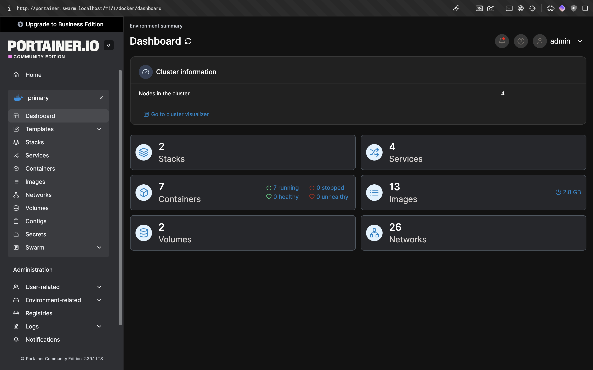

### Suppression de la stack voting

commadne : `docker exec -it infra-manager-1 ash`

commande : `docker stack rm voting`

### Mise en place de la stack voting avec Portainer

commentaire : maintenant qu'on a supprimé la stack voting de notre cluster Swarm,
on va faire en sorte de le déployer dans Portainer pour ce faire on va sur Portainer,
on va ensuite aller dans la section "Stacks" et on va cliquer sur "Add stack" pour ajouter une nouvelle stack.
Il va falloir lui donner un nom ici "voting" et ensuite on va copier le contenu du fichier voting-stack.yml dans la section "Web editor" 
et ensuite on va cliquer sur "Deploy the stack" pour déployer la stack voting sur notre cluster Swarm.

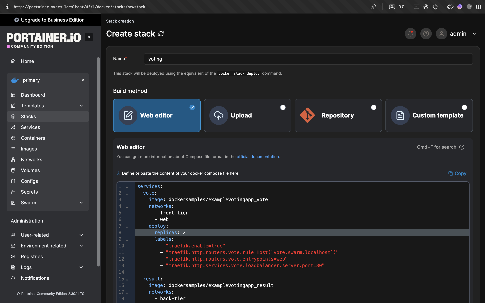

### Vérification du déploiement de la stack voting avec Portainer

commentaire : on peut ensuite aller dnas la section "Containers" 
pour vérifier que les conteneurs de la stack voting sont bien en cours d'exécution et que les services sont accessibles depuis l'extérieur du cluster Swarm.

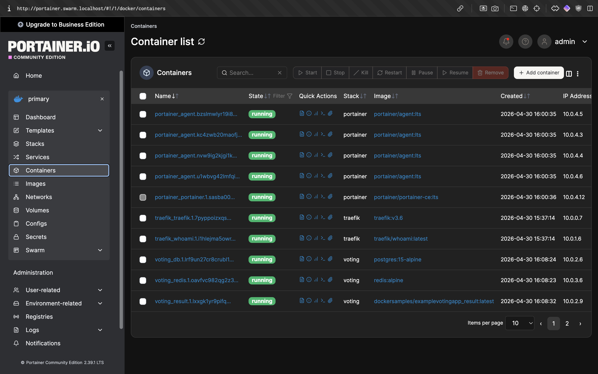

## Exercice 1 - Déployer MFP

### Création de l'endpoint de l'API hello-world

commentaire : ajout d'un fichier Hello.ts comme controller pour créer un endpoint de l'API hello-world qui retourne un message de bienvenue.

```typescript
import { Router } from "express";

const helloRouter = Router();

helloRouter.get("/", (req, res) => {
    res.status(200).send("Bonjour !");
});

export default helloRouter;
```

Ensuite, dans le fichier router.ts, 
il faut importer le controller Hello.ts 
et l'ajouter à la route /hello pour que l'endpoint de l'API 
hello-world soit accessible via l'URL http://localhost:3000/hello.

```typescript
apiRouter.use("/hello", helloRouter);
```

### Modification du github action pour ajouter un tag aux images docker que l'on push 

commentaire : on va faire en sorte d'ajouter un tag aux images docker.
Le tag sera composé du nom de l'image et du short SHA du commit pour pouvoir identifier facilement les images docker qui ont été push.

```yaml
name: MFP CI

on:
  push:
    branches:
      - main

permissions:
  contents: read
  packages: write

jobs:
  build:
    runs-on: ubuntu-latest

    steps:
      - name: Checkout repository
        uses: actions/checkout@v3

      - name: Use Node.js
        uses: actions/setup-node@v4
        with:
          node-version: '20.x'

      - name: Install backend dependencies
        working-directory: ./server
        run: npm install

      - name: Run backend tests
        working-directory: ./server
        run: npm test

      - name: Setup Docker Buildx
        uses: docker/setup-buildx-action@v3

      - name: Get short SHA
        id: vars
        run: echo "sha_short=$(echo $GITHUB_SHA | cut -c1-7)" >> $GITHUB_OUTPUT

      - name: Log in to GitHub Container Registry
        uses: docker/login-action@v2
        with:
          registry: ghcr.io
          username: ${{ github.actor }}
          password: ${{ secrets.GITHUB_TOKEN }}

      - name: Build backend Docker image
        run: |
          docker build \
            -t ghcr.io/a5hura666/favorite_places_server:latest \
            -t ghcr.io/a5hura666/favorite_places_server:main \
            -t ghcr.io/a5hura666/favorite_places_server:sha-${{ steps.vars.outputs.sha_short }} \
            ./server

      - name: Build frontend Docker image
        run: |
          docker build \
            -t ghcr.io/a5hura666/favorite_places_client:latest \
            -t ghcr.io/a5hura666/favorite_places_client:main \
            -t ghcr.io/a5hura666/favorite_places_client:sha-${{ steps.vars.outputs.sha_short }} \
            ./client

      - name: Push backend image
        run: |
          docker push ghcr.io/a5hura666/favorite_places_server:latest
          docker push ghcr.io/a5hura666/favorite_places_server:main
          docker push ghcr.io/a5hura666/favorite_places_server:sha-${{ steps.vars.outputs.sha_short }}

      - name: Push frontend image
        run: |
          docker push ghcr.io/a5hura666/favorite_places_client:latest
          docker push ghcr.io/a5hura666/favorite_places_client:main
          docker push ghcr.io/a5hura666/favorite_places_client:sha-${{ steps.vars.outputs.sha_short }}
```

commentaire : on peut maintenant push le code sur main et vérifier après le github action
que les images docker ont bien été push avec un tag qui correspond au short SHA du commit.

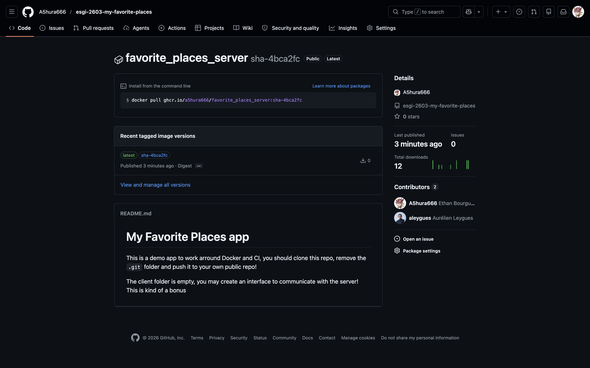

### Ajout dans Host mfp.swarm.localhost

commentaire : pour pouvoir accéder à l'application MFP depuis l'extérieur du cluster Swarm,
il est nécessaire d'ajouter une entrée dans le fichier host pour que l'application MFP puisse être accessible en utilisant le nom de domaine mfp.swarm.localhost.

```BASH
127.0.0.1   mfp.swarm.localhost
```

### Création d'un fichier docker-compose.yml pour déployer l'application MFP

```YAML
services:
  api:
    image: ghcr.io/a5hura666/favorite_places_server:main
    networks:
      - web
      - app
    environment:
      DB_HOST: db
      DB_USER: postgres
      DB_PASSWORD: supersecret
      DB_NAME: postgres
    deploy:
      mode: replicated
      replicas: 1
      placement:
        constraints: [node.role == manager]
      labels:
        - "traefik.enable=true"
        - "traefik.http.routers.mfp.rule=Host(`mfp.swarm.localhost`)"
        - "traefik.http.routers.mfp.entrypoints=web"
        - "traefik.http.services.mfp.loadbalancer.server.port=3000"

  postgres:
    image: postgres:16
    volumes:
      - postgres_data:/var/lib/postgresql/data
    environment:
      POSTGRES_USER: postgres
      POSTGRES_PASSWORD: supersecret
      POSTGRES_DB: postgres
    networks:
      - app

networks:
  web:
    external: true
  app:

volumes:
  postgres_data:
```

### Déployer l'application MFP sur portainer

commentaire : pour déployer l'application MFP, il est nécessaire de se connecter à Portainer,
aller dans la section "Stacks" et cliquer sur "Add stack" pour ajouter une nouvelle
stack. Il faut lui donner un nom ici "mfp" et ensuite copier le contenu du fichier docker-compose.yml 
dans la section "Web editor" et cliquer sur "Deploy the stack" pour déployer l'application MFP sur notre cluster Swarm.


## Exercice 2 - Ajouter Shepherd :

commentaire : Ajout d'un fichier shepherd.compose.yml pour déployer Shepherd sur le cluster Swarm.

```YAML
version: "3"

services:
  app:
    image: containrrr/shepherd
    environment:
      # Beware YAML gotchas regarding quoting:
      # With KEY: 'VALUE', quotes are part of yaml syntax and thus get stripped
      # but with KEY='VALUE', they are part of the value and stay there,
      # causing problems!
      TZ: 'Europe/Paris'
      SLEEP_TIME: '1m'
      FILTER_SERVICES: ''
      VERBOSE: 'true'
      #UPDATE_OPTIONS: '--update-delay=30s'
      #ROLLBACK_OPTIONS: '--rollback-delay=0s'
    volumes:
      - /var/run/docker.sock:/var/run/docker.sock
    deploy:
      placement:
        constraints:
          - node.role == manager

networks:
  web:
    external: true
  agent_network:
    external: true
```

### Déployer Shepherd sur le cluster Swarm

commentaire : pour déployer Shepherd, il est nécessaire de se connecter à Portainer,
aller dans la section "Stacks" et cliquer sur "Add stack" pour ajouter une nouvelle
stack. Il faut lui donner un nom ici "shepherd" et ensuite copier le contenu du fichier shepherd.compose.yml
dans la section "Web editor" et cliquer sur "Deploy the stack" pour déployer Shepherd sur notre cluster Swarm.


### Observation des logs

commentaire : après le déploiement de Shepherd, on peut observer les logs.

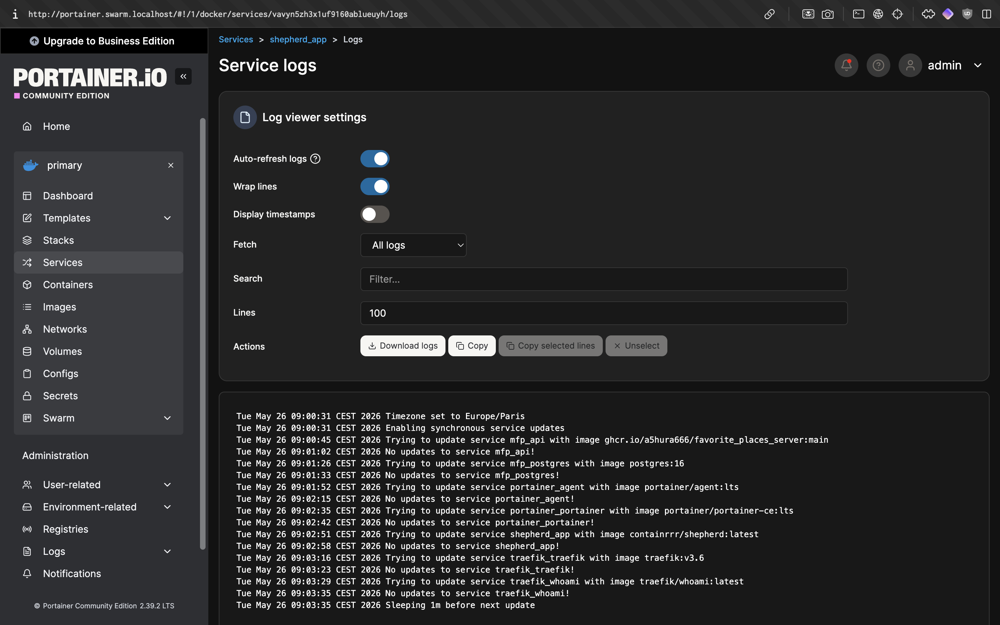

commentaire : En regardant les logs de Shepherd,
on voit :

`Trying to update service mfp_api with image ghcr.io/a5hura666/favorite_places_server:main No updates to service mfp_api!`

Cela montre que Shepherd :
- détecte bien le service mfp_api
- vérifie l’image Docker associée
- compare les versions disponibles
- mais ne trouve aucune nouvelle image à déployer pour le moment

On voit aussi que Shepherd effectue cette vérification automatiquement toutes les minutes :

`Sleeping 1m before next update`

Ce qui montre bien que le synchronisation toutes les minutes marchent !

Et c'est normal on n'a fait encore aucun changement sur notre application MFP depuis le déploiement de Shepherd,
mais dès que nous ferons un changement sur notre application MFP et que nous pousserons une nouvelle image Docker via le github action,
Shepherd détectera automatiquement la nouvelle image Docker et mettra normalement à jour le service mfp_api avec la nouvelle image Docker sans que nous ayons besoin d'intervenir manuellement pour faire le déploiement de la nouvelle image Docker.

### Tester le fonctionnement de Shepherd

commentaire : pour tester le fonctionnement de Shepherd, il suffit de faire un changement sur notre application MFP,
je vais donc changer le message de l'api qui retourne "Bonjour !" par "Hello !" dans le fichier Hello.ts.

```typescript
import { Router } from "express";

const helloRouter = Router();

helloRouter.get("/", (req, res) => {
    res.status(200).send("Hello !");
});

export default helloRouter;
```

Ensuite, je push le code sur main pour que le github action puisse builder une nouvelle image Docker avec le changement que j'ai fait et la push sur GitHub.
Après cela, il suffit d'attendre que Shepherd détecte la nouvelle image Docker et mette à jour le service mfp_api avec la nouvelle image Docker.


commentaire : on peut voir avec la capture d'écran ci-dessus que Shepherd a détecté la nouvelle image Docker et a mis à jour le service mfp_api avec la nouvelle image Docker.

## Schéma de toutes les briques utilisées d'un push sur main jusqu'au déploiement de la nouvelle image Docker :

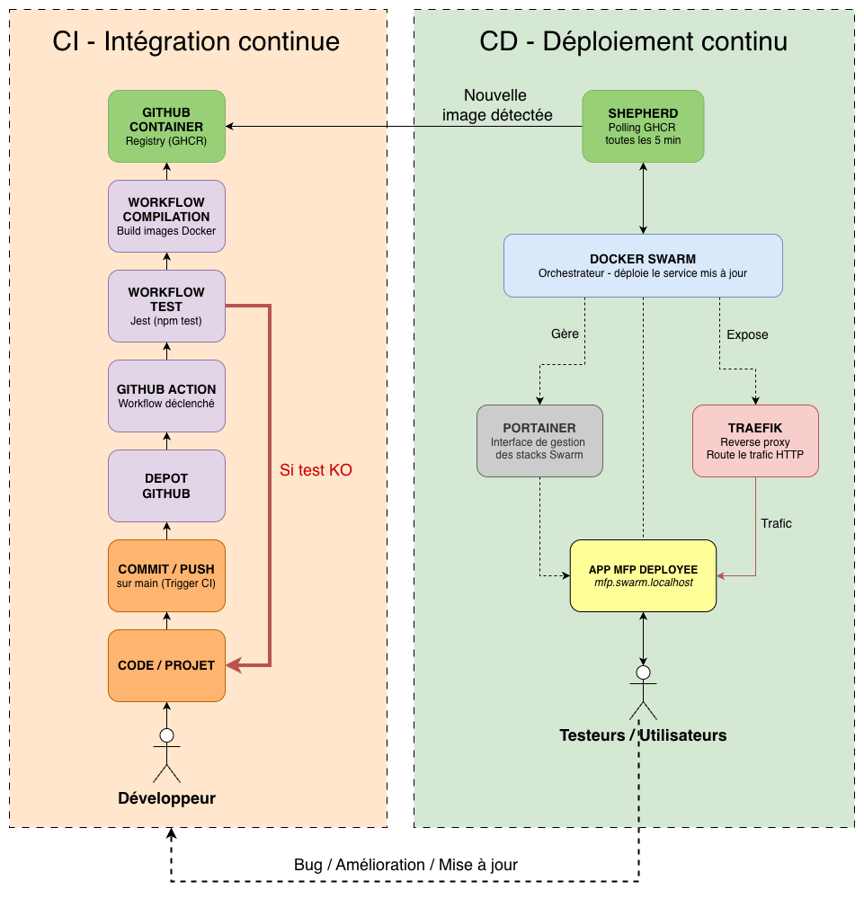

### Descriptif complet du schéma :

#### CI — Intégration continue

1. Développeur modifie le code et fait un git push sur la branche main 
2. GitHub Actions est déclenché automatiquement par le push 
3. Tests Jest s'exécutent — si KO, le pipeline s'arrête et le développeur corrige 
4. Build Docker produit les images taguées :latest, :main 
5. GHCR reçoit et stocke les nouvelles images

#### CD — Déploiement continu

6. Shepherd poll le GHCR toutes les 5 minutes et détecte la nouvelle image 
7. Docker Swarm reçoit l'ordre de mise à jour et redéploie le service avec la nouvelle image 
8. Portainer permet de visualiser et gérer les stacks Swarm via une interface web 
9. Traefik route automatiquement le trafic HTTP vers le nouveau conteneur via mfp.swarm.localhost configurer dans le fichier host
10. L'app MFP est accessible aux utilisateurs dans sa nouvelle version (dans le cadre du TP en local)

#### Boucle de feedback (dans un cas de mise en prod réel)

11. Testeurs / Utilisateurs détectent un bug ou suggèrent une amélioration → retour au développeur → nouveau cycle CI/CD